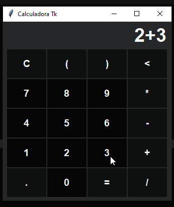

<div align='center'>
    <h1>Calculadora Tk</h1>
    
</div>

## Motivação
O projeto tem por objetivo incentivar iniciantes na programação em python a contribuir com projetos open source que vão além do Terminal, de modo que seja mais visual o desenvolvimento. 

Sendo assim, foi criado a Calculadora Tk com funcionalidades matemáticas básicas e com alguns erros propositais para que as correções e ampliações de novas funcionalidades sejam feitas pelo público alvo (Iniciantes).

## Para contribuir
Siga os passos abaixo:

1. Faça o `Fork` do projeto [Calculadora Tk](<https://github.com/matheusfelipeog/calculadora-tk.git>) no canto superior direito da tela;
2. Clone o projeto do seu repositório no github (`git clone https://github.com/SEU_USUARIO/calculadora-tk.git`);
3. Crie sua branch para realizar sua modificação (`git checkout -b feature/nome_da_modificação`);
4. Após ter realizado suas modificações, faça um `commit` (`git commit -m "Descrição da modificação"`);
5. Faça o `Push` para seu repositório (`git push origin feature/nome_modificação`);
6. No seu repositório no *Github* crie uma `Pull Request` para que seja avaliada a suas modificações para ser feito o `merge` no projeto principal.

## Contribuidores

| [<br /><sub>@aguiarcandre</sub>](https://github.com/aguiarcandre) | [<br /><sub>@carlos3g</sub>](https://github.com/carlos3g) | [<br /><sub>@ericllma</sub>](https://github.com/ericllma) | [<br /><sub>@sam-chami</sub>](https://github.com/sam-chami) | [<br /><sub>@taisbferreira</sub>](https://github.com/taisbferreira) | [<br /><sub>@edilsonmatola</sub>](https://github.com/edilsonmatola) |
|:-:|:-:|:-:|:-:|:-:|:-:|
| [<br /><sub>@maguzzz</sub>](https://github.com/maguzzz) |

## Para ideias/Bugs
Caso encontre algum bug crie uma `issue` descrevendo o Bug encontrado que tem que ser resolvido, informando o passo a passo para replicá-lo.

E caso tenha alguma ideia de nova funcionalidade que possa ser implementada por outros iniciantes, crie uma `issue` descrevendo essa ideia. ;)

## Start
```
$ python main.py
```

ou crie seu próprio arquivo com o seguinte script, e depois siga o procedimento acima com o nome correspondente:
```Python
# -*- coding: utf-8 -*-

# Builtin
import tkinter as tk

# Internal module
from app.calculadora import Calculadora

if __name__ == '__main__':
    master = tk.Tk()
    main = Calculadora(master)
    main.start()
```

## Guias
- Tkinter: [Documentação](https://docs.python.org/3/library/tkinter.html) - *Existe diversos outros guias em mostra logo no ínicio do página*
- Git e Github: [Tutorial no Tableless](https://tableless.com.br/tudo-que-voce-queria-saber-sobre-git-e-github-mas-tinha-vergonha-de-perguntar/) - *Leitura*
- Git e Github: [Tutorial no Youtube](https://www.youtube.com/playlist?list=PLQCmSnNFVYnRdgxOC_ufH58NxlmM6VYd1) - *Vídeo Aula*
- Pull Request no GitHub: [Tutorial DigitalOcean](https://www.digitalocean.com/community/tutorials/como-criar-um-pull-request-no-github-pt) - *Leitura*
